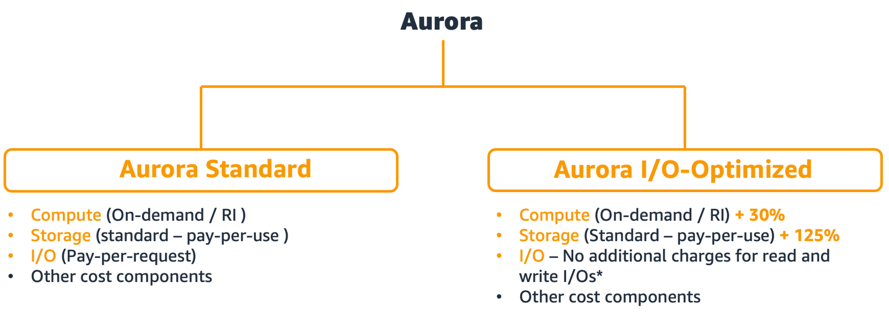

# 6.1 Understanding Aurora Cost Components

Amazon Aurora clusters are available in two pricing models—Aurora Standard and Aurora I/O-Optimized—each designed to cater to different workload patterns and cost-efficiency needs.

| Component | Description |
|-----------|-------------|
| Compute | DB Instance Class, Count, or Aurora Capacity Units (ACUs) for Serverless |
| Storage | GBs of database volume used |
| I/O Operations | Read/Write IOPS from/to Aurora storage |
| Backups | Size and retention of automated/manual snapshots |
| Data Transfer | Inter-AZ or inter-region traffic |

## Topics

- [Aurora Standard](#aurora-standard)
- [Aurora I/O-Optimized](#aurora-i/o-optimized)
- [When to Choose Aurora Standard or I/O-Optimized](#when-to-choose-aurora-standard-or-io-optimized)

## Aurora Standard
This is the default configuration and is ideal for workloads with moderate and predictable I/O usage. Costs are broken down into:

- Compute: Billed based on instance type and usage (On-Demand or Reserved Instances).
- Storage: Charged on a pay-per-use basis for the storage consumed.
- I/O: Charged separately on a pay-per-request model, which means the more read/write operations you perform, the higher your costs.
- Other Features: Additional charges may apply for features like backtracking, global databases, and snapshot exports.

## Aurora I/O-Optimized
This option is better suited for I/O-intensive applications were eliminating variable I/O charges provides more predictable costs. Our tests showed that Amazon Aurora I/O-Optimized cluster configuration can [save up to 40% for I/O-Intensive Applications](https://aws.amazon.com/blogs/aws/new-amazon-aurora-i-o-optimized-cluster-configuration-with-up-to-40-cost-savings-for-i-o-intensive-applications/).

- Compute: Billed similarly to the standard model but incurs a 30% premium.
- Storage: Still pay-per-use but with a 125% cost increase over the standard model.
- I/O: No additional charges for I/O operations—read and write requests are included in the compute and storage pricing, making this attractive for high-throughput applications.
- Other Features: Feature-based costs remain the same as with the standard model.

## When to Choose Aurora Standard or I/O-Optimized

Choose **Aurora Standard** when:
- Your workload has moderate, predictable I/O patterns
- I/O costs represent less than 25% of your total Aurora bill
- You're running development, testing, or low-traffic production workloads
- Cost predictability for I/O is not a primary concern

> 💡 **Note**: Your Aurora cluster cost can vary among different clusters. You have the flexibility to select different storage types for each cluster based on their specific cost requirements and usage patterns. To learn more about managing and monitoring these costs, see our guide on [tagging strategy for cost tracking and monitoring](../6.3_Optimizing_Cost_Efficiency/README.md).

Choose **Aurora I/O-Optimized** when:
- Your application performs high-volume read/write operations
- I/O costs exceed 25% of your total Aurora bill
- You need predictable monthly costs without I/O variability
- Running analytics, reporting, or high-throughput transactional workloads

> 💡 **Note**: You can estimate cost savings for the [Amazon Aurora I/O-Optimized feature using Amazon CloudWatch](https://aws.amazon.com/blogs/database/estimate-cost-savings-for-the-amazon-aurora-i-o-optimized-feature-using-amazon-cloudwatch/).

## Next Steps

🎉 **Excellent!** You've implemented monitoring, alerting, and performance optimization strategies. Your operational excellence skills are top-notch!

**Ready to continue?** Let's advance to [6.2 Performance Tuning Strategies](../6.2_Performance_Tuning_Strategies) and unlock advanced techniques to supercharge your Aurora database performance!

## Learn More

- [AWS Cost Optimization Workshop - Reduce costs while maintaining performance](https://catalog.workshops.aws/well-architected-cost-optimization/en-US)
- [Aurora I/O-Optimized - New storage configuration for I/O-intensive workloads](https://docs.aws.amazon.com/AmazonRDS/latest/AuroraUserGuide/Aurora.Overview.StorageReliability.html#aurora-storage-type)
- [RDS Reserved Instances - Save up to 75% with 1 or 3-year capacity reservations](https://docs.aws.amazon.com/AmazonRDS/latest/UserGuide/USER_WorkingWithReservedDBInstances.html)
- [Aurora Cost Optimization Guide - Strategies for optimizing database costs and performance](https://docs.aws.amazon.com/AmazonRDS/latest/AuroraUserGuide/Aurora.Managing.Performance.html)
