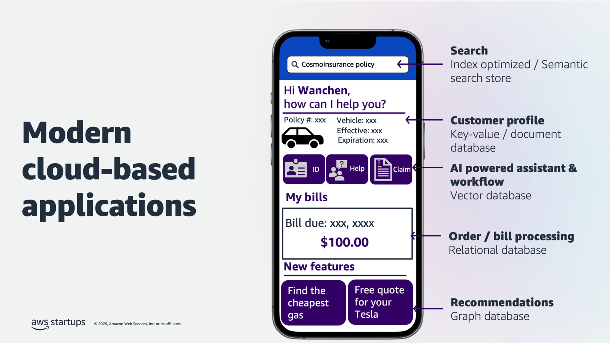
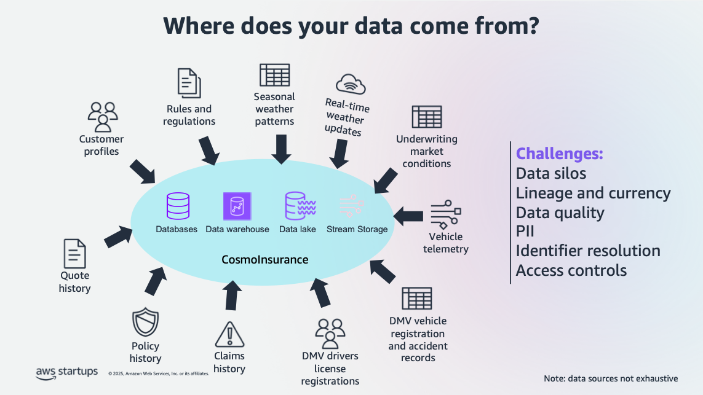
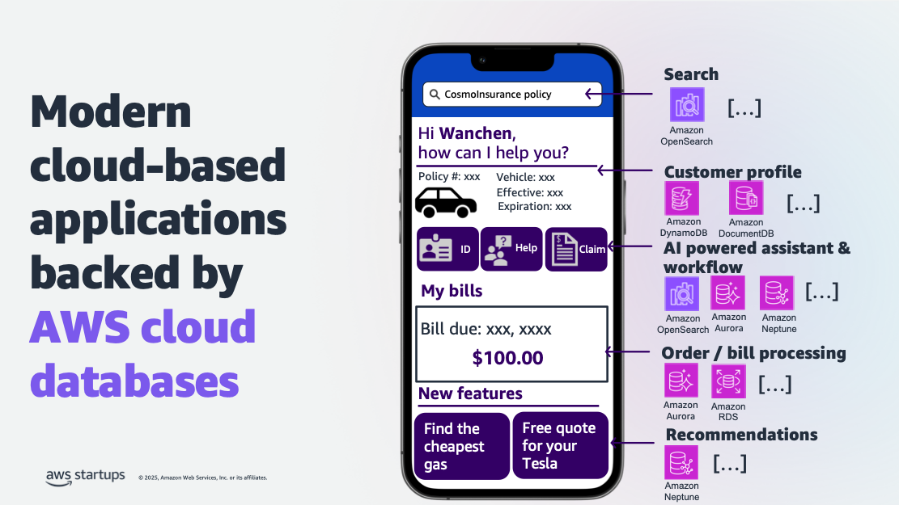
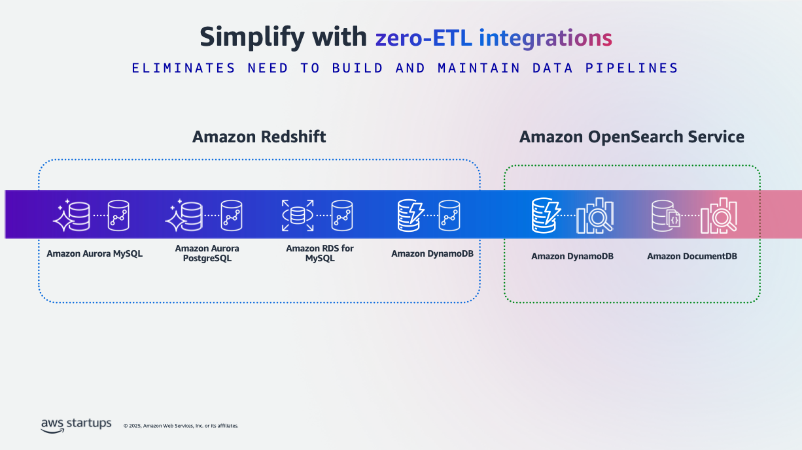
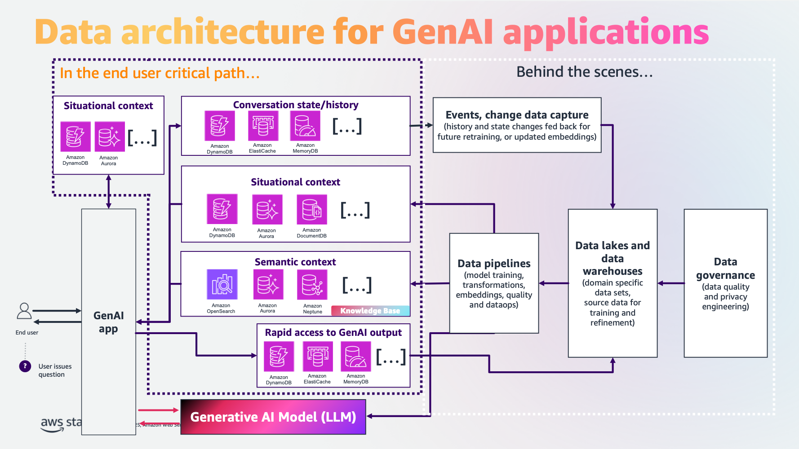
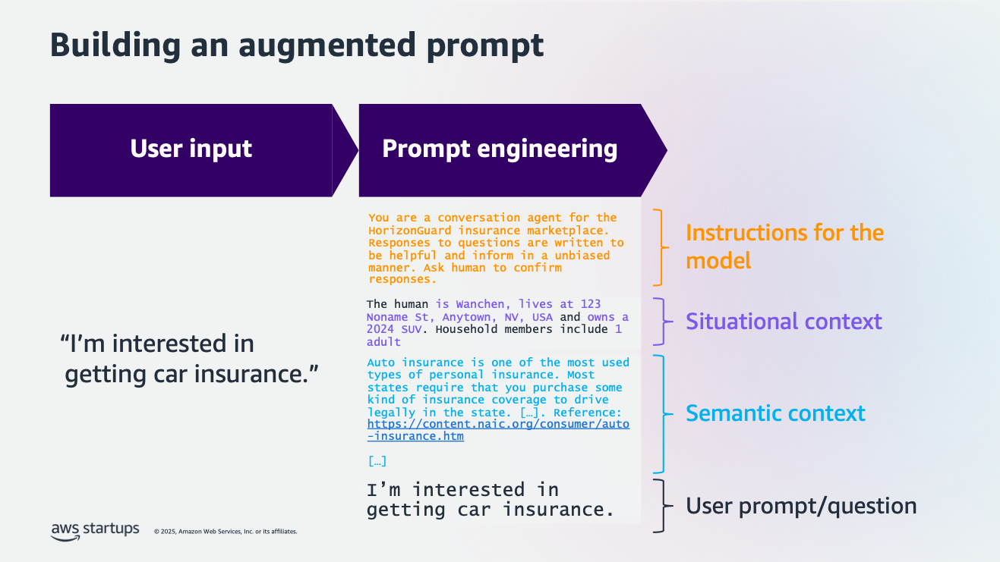
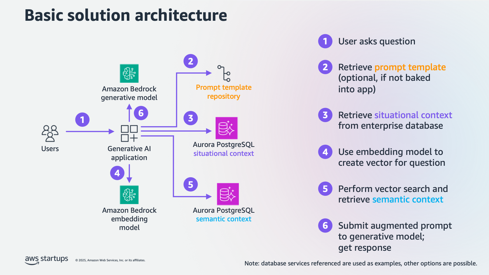

# 8.1 Data as Your Strategic Asset for GenAI Applications

Studies highlight the challenges organizations face in leveraging their data effectively: While more and more organizations recognize the importance of data-driven decision making, they still struggle to effectively leverage data for insights. Those that succeed are seeing substantial revenue growth, and there's a marked increase in organizations becoming data-driven, potentially catalyzed by the transformative potential of Generative AI.

- **74%** of businesses fail to turn data into insights ([Harvard Business Review: "Why Becoming a Data-Driven Organization is So Hard"](https://hbr.org/2022/02/why-becoming-a-data-driven-organization-is-so-hard))
- **82%** of organizations have appointed a Chief Data Officer (CDO) ([Forrester: "Data into Dollars"](https://www.forrester.com/blogs/data-into-dollars-can-you-turn-your-data-into-revenue/))
- **20%** revenue growth seen by data-insights driven businesses ([Forrester: "Data into Dollars"](https://www.forrester.com/blogs/data-into-dollars-can-you-turn-your-data-into-revenue/))
- **75%** of businesses worldwide will adopt AI by 2027—a milestone less than two years away—according to the World Economic Forum.([2023 World Economic Forum’s Future of Jobs Report](https://www.weforum.org/stories/2023/05/future-of-jobs-technology-skills-workplace/)) 
- **48.1%** of organizations report having created a data-driven organization in 2024, more than doubling from 23.9% in 2023. ([Wavestone Survey: Data and AI executive leadership survey 2024 ](https://www.wavestone.com/en/insight/data-ai-executive-leadership-survey-2024/))
- **62.3%** view Generative AI as a top organizational priority.([Wavestone Survey: Data and AI executive leadership survey 2024 ](https://www.wavestone.com/en/insight/data-ai-executive-leadership-survey-2024/))
- **64.2%** believe it has the potential to be the most transformational technology in a generation.([Wavestone Survey: Data and AI executive leadership survey 2024 ](https://www.wavestone.com/en/insight/data-ai-executive-leadership-survey-2024/))
- **89.6%** are increasing investment in Generative AI.([Wavestone Survey: Data and AI executive leadership survey 2024 ](https://www.wavestone.com/en/insight/data-ai-executive-leadership-survey-2024/))

These statistics from leading research firms underscore the importance of a robust data strategy for GenAI applications.

## Topics

- [The State of GenAI Adoption and Database Integration](#the-state-of-genai-adoption-and-database-integration)
- [Building a Modern Cloud-Based Application](#building-a-modern-cloud-based-application)
- [Data Sources and Challenges](#data-sources-and-challenges)
- [Leveraging AWS Fully Managed Cloud Databases](#leveraging-aws-fully-managed-cloud-databases)
- [Leveraging AWS Zero-ETL Integration](#leveraging-aws-zero-etl-integration)
- [Behind the Scenes: GenAI Application Flow](#behind-the-scenes-genai-application-flow)
- [Implementing RAG (Retrieval Augmented Generation)](#implementing-rag-(retrieval-augmented-generation))
- [Evolution of RAG Methods](#evolution-of-rag-methods)
- [Advanced RAG Techniques](#advanced-rag-techniques)
- [Using Amazon Bedrock Agents for Orchestration](#using-amazon-bedrock-agents-for-orchestration)
- [Model Context Protocol (MCP) and RAG Integration](#model-context-protocol-(mcp)-and-rag-integration)
- [Best Practices ✅](#best-practices-✅)
- [Troubleshooting FAQ ❓](#troubleshooting-faq-❓)

## The State of GenAI Adoption and Database Integration

Studies reveal critical insights about GenAI implementation and success factors. [Deloitte's "State of Generative AI in the Enterprise 2024 Q3 Report"](https://www2.deloitte.com/us/en/pages/consulting/articles/state-of-generative-ai-in-enterprise.html) found that across 2,770 organizations, **only 26% of GenAI experiments have moved to production**, highlighting a significant gap between experimentation and deployment. Internal AWS studies demonstrate that organizations achieve **substantially 70% increase in success rates when implementing GenAI with robust database foundations**. These findings underscore that successful GenAI implementations require both practical, production-ready approaches and strong data infrastructure.

## Building a Modern Cloud-Based Application

Let's explore how to implement a GenAI-powered application like CosmoInsurance, focusing on providing personalized auto insurance quotes.



**Key components:**

- **Search functionality ([Amazon OpenSearch](https://aws.amazon.com/opensearch-service/))**: Enables fast, accurate retrieval of relevant insurance information and policies.
- **Customer profiles ([Amazon DynamoDB](https://aws.amazon.com/dynamodb/)/[Amazon DocumentDB](https://aws.amazon.com/documentdb/))**: Stores and manages customer data with high performance and scalability.
- **AI-powered assistant ([Vector database](https://aws.amazon.com/what-is/vector-databases/))**: Facilitates semantic search and intelligent query processing for personalized interactions.
- **Billing processing ([Amazon Aurora](https://aws.amazon.com/rds/RDS(https://aws.amazon.com/rds/))**: Handles transactional data with strong consistency and ACID compliance.
- **Recommendations ([Amazon Neptune](https://aws.amazon.com/neptune/))**: Leverages graph relationships for personalized insurance product suggestions.

## Data Sources and Challenges

### Where Does Your Data Live?



Your organizational knowledge exists in many forms:

- Customer interactions in CRM systems
- Documents and presentations in content management systems
- Transactions in operational databases
- Regulations and policies in knowledge bases
- Real-time data from applications and devices

Organizations face multiple data management hurdles in their GenAI journey. Data silos prevent efficient information sharing across departments, while maintaining data quality and understanding data lineage remains crucial for reliable AI outcomes. Self-managed data stores often struggle with proper PII handling, access control implementation, and identifier resolution across systems, which poses significant challenges that must be addressed for successful GenAI implementations.

## Leveraging AWS Fully Managed Cloud Databases

AWS offers a comprehensive suite of [purpose-built databases](https://aws.amazon.com/products/databases/) to suit for your exact workload needs:

- Relational: [Amazon Aurora(MySQL, PostgreSQL)](https://aws.amazon.com/rds/aurora/), [Amazon Aurora DSQL - serverless distributed SQL](https://aws.amazon.com/rds/aurora/dsql/)
- Key-Value: [Amazon DynamoDB](https://aws.amazon.com/dynamodb/)
- Wide column: [Amazon Keyspaces(for Apache Cassandra)](https://aws.amazon.com/keyspaces/)
- Document (JSON): [Amazon DocumentDB(with MongoDB compatibility)](https://aws.amazon.com/documentdb/)
- Graph: [Amazon Neptune](https://aws.amazon.com/neptune/)
- Time-Series: [Amazon Timestream](https://aws.amazon.com/timestream/)
- In-Memory: [Amazon ElastiCache](https://aws.amazon.com/elasticache/), [Amazon MemoryDB(Valkey- and Redis OSS-compatible)](https://aws.amazon.com/memorydb/)

These services reduce administrative overhead by up to 80% such as schema design, automatic failover, security compliance, resource scaling, monitoring, and maintenance, allowing teams to focus on innovation and business insights through application development, data-driven strategy, and customer experience improvements.

Now, your implementation looks like the following.



## Leveraging AWS Zero-ETL Integration

AWS eliminates the need to build and maintain complex data pipelines through native integrations between services:



This [zero-ETL approach](https://aws.amazon.com/what-is/zero-etl/) enables:

- Seamless data movement between operational and analytical stores
- Real-time analytics on transactional data
- Reduced operational complexity and maintenance
- Lower total cost of ownership
- Improved data freshness and reliability

> 💡 **Note:** AWS is investing in a zero-ETL future. [Read more to keep up to date for more 0-ETL capabilities](https://aws.amazon.com/what-is/zero-etl/).

## Behind the Scenes: GenAI Application Flow

Let's break down a typical interaction:

```plaintext
User: "I'm interested in getting car insurance."
```



1. **Conversation State/History**: 
   - Service: Amazon ElastiCache / Amazon MemoryDB / Amazon DynamoDB
   - Purpose: Maintain context, and quick retrieval for context beyond what LLM can provide.

2. **Situational Context**: 
   - Service: Amazon DynamoDB / Amazon Aurora / Amazon RDS / Amazon DocumentDB
   - Purpose: Retrieve user data, preferences, and historical interactions to enable personalized and contextually relevant responses. This layer is critical for differentiating your GenAI application - while foundation models provide general intelligence, your organization's data about customer relationships, past interactions, and specific context enables truly personalized experiences that competitors cannot easily replicate.

3. **AI Processing**: 
   - Service: [Amazon Bedrock](https://aws.amazon.com/bedrock/)
   - Purpose: Natural language understanding

4. **Knowledge Retrieval**: 
   - Service: [Vector database](https://aws.amazon.com/what-is/vector-databases/), such as Amazon OpenSearch Service, Amazon Aurora PostgreSQL with pgvector, Amazon Neptune
   - Purpose: Access relevant insurance inforamtion, documents, policies, knowledge within the organization

5. **Response Generation**: 
   - Service: Amazon Bedrock
   - Purpose: Create personalized reply

## Implementing RAG (Retrieval Augmented Generation)

Your **unstructured**(structured, semi-structured) data sources (e.g. pdfs, images, videos) have to be **vectorized into something called vector embeddings** or numerical representations to be stored either in memory or a persistent storage for the machine learning (ML) models or the large language model (LLM) to understand and respond to your questions.

> 💡 **Note:** You don't have to vectorize your structured/semi-structured data to be able to retrieve by your ML/LL models. Think of: you have an Excel sheet with user orders in the past and pdf documents with insurance policies. You can do a filter by transaction_id column to locate the exact transaction quickly (e.g. select * from user_orders where transaction_id = '123';), while you will do a similarity search using vector embeddings to quickly find the insurance policy documents that semantically relevant to your query.


Building an augmented prompt involves combining multiple elements to create a more effective and contextualized interaction with an AI model. The process begins with user input, which is then enhanced through prompt engineering. This includes adding instructions for the model, such as specifying its role (e.g., as a conversation agent for an insurance marketplace) and defining response parameters. Situational context is incorporated, providing specific details about the user (like Wanchen's location and vehicle information) to personalize the interaction. Semantic context is also added, including relevant domain knowledge (such as information about auto insurance requirements). These components are combined with the user's prompt or question to form an augmented prompt. This enhanced prompt is then submitted to a generative AI model, which uses this rich context to provide more accurate, relevant, and personalized responses.



Looking to manage both situational and semantic contexts efficiently? [Amazon Aurora PostgreSQL](https://docs.aws.amazon.com/AmazonRDS/latest/AuroraUserGuide/Aurora.AuroraPostgreSQL.html) offers a fully managed database solution that can handle both types of context storage needs. For situational context, it stores user-specific data like historical user transactions, personal information and preferences via OLTP queries ([Performing a proof of concept with Amazon Aurora](https://docs.aws.amazon.com/AmazonRDS/latest/AuroraUserGuide/aurora-poc.html)), while for semantic context, it stores vector embeddings via [pgvector](https://github.com/pgvector/pgvector) for domain knowledge and reference materials. When integrated with Amazon Bedrock's embedding models, Aurora PostgreSQL enables vector search capabilities, making it ideal for retrieving relevant context that enhances your AI application's responses.

> 💡 **Note**: Ready to build AI-powered applications? The [Generative AI with Aurora Workshop](https://catalog.workshops.aws/genai-with-aurora/en-US) shows you how to combine vector databases with large language models. You\'ll build intelligent applications that can understand and generate human-like responses using your own data.



## Evolution of RAG Methods

### 1. Basic RAG

Basic RAG represents the simplest implementation of retrieval-augmented generation, offering a straightforward approach to knowledge retrieval. It typically involves direct vector similarity search without sophisticated pre-processing or validation steps. While quick to implement, it may face challenges with complex queries or when high accuracy is required. This approach is best suited for simple question-answering scenarios where the context is clear and direct.

### 2. Advanced RAG

Advanced RAG builds upon the basic implementation by incorporating sophisticated search techniques and validation processes. It combines vector search with keyword-based approaches (hybrid search), implements pre-retrieval filtering to improve relevance, and includes post-retrieval validation to ensure response accuracy. This method often achieves better results through techniques like re-ranking, context summarization, and structured data integration, making it suitable for production environments where accuracy is crucial.

### 3. Agentic RAG

Agentic RAG represents the most sophisticated approach, employing autonomous AI agents that can reason, plan, and execute complex multi-step tasks. Unlike traditional RAG systems that simply retrieve and generate, Agentic RAG uses intelligent agents to dynamically select retrieval strategies, validate information across multiple sources, and perform actions based on retrieved context. These agents can seamlessly switch between different retrieval strategies (vector search, GraphRAG, text-to-SQL), interact with external APIs, and make decisions about when to gather additional information or execute specific tasks. This autonomous capability makes it ideal for complex applications requiring multi-step reasoning, dynamic decision-making, and integration with business processes.

## Advanced RAG Techniques

### Hybrid Search

Combining vector search with keyword-based search for improved accuracy.

### Text-to-SQL

For queries requiring precise aggregations or exact counts, vector search might not be the best approach. These scenarios require 100% recall (retrieving all relevant records without missing any) to ensure accurate calculations. While vector search excels at semantic similarity, it's not designed for exact match or complete set operations.

The workflow involves:

1. User asks a question requiring precise data retrieval.
2. The LLM translates the natural language query into a SQL query.
3. The SQL query is executed against a relational database.
4. Results are formatted and returned to the user.

**100% recall** is crucial for scenarios such as:

- Financial calculations (total spending, average payments)
- Compliance reporting (complete audit trails)
- Inventory management (exact stock counts)
- Transaction history (complete payment records)
- Usage analytics (precise user activity metrics)

Example scenario:

```
User: "What's the total amount I paid for car insurance in the last 3 years?"

LLM generates SQL: 
SELECT 
    YEAR(payment_date) as year,
    SUM(premium_amount) as yearly_total,
    COUNT(payment_id) as payment_count
FROM insurance_payments
WHERE customer_id = 'USER123' 
    AND payment_date >= DATEADD(year, -3, CURRENT_DATE)
GROUP BY YEAR(payment_date)
ORDER BY year DESC;

Database returns:
2024: $1,200 (12 payments)
2023: $990 (12 payments)
2022: $900 (12 payments)

LLM formats response:
"Over the past three years, you paid:
- 2024: $1,200 (monthly payments of $100)
- 2023: $990 (monthly payments of $82.50)
- 2022: $900 (monthly payments of $75)
Total: $3,090"
```

In these cases, using vector search could lead to incomplete or inaccurate results, as it might miss relevant records or provide approximate matches. Traditional SQL queries ensure every matching record is included in the calculation, providing the exact accuracy required for business-critical operations.

> 💡 **Note: Understanding Precision vs. Recall**
> 
> ```
> Search Result Types:
> TP (True Positive)  = Relevant items that were retrieved
> FP (False Positive) = Irrelevant items that were retrieved
> FN (False Negative) = Relevant items that were not retrieved
> 
> Precision = TP / (TP + FP)  [How many retrieved items are relevant]
> Recall = TP / (TP + FN)     [How many relevant items were retrieved]
> 
> Example Scenarios:
> ┌───────────────┬───────────┬────────┬────────────────────────────┐
> │ Search Type   │ Precision │ Recall │ Best For                   │
> ├───────────────┼───────────┼────────┼────────────────────────────┤
> │ Vector Search │ High      │ Medium │ Semantic similarity        │
> │ SQL Query     │ High      │ 100%   │ Exact counts/aggregations  │
> │ Hybrid Search │ High      │ High   │ Complex mixed queries      │
> └───────────────┴───────────┴────────┴────────────────────────────┘
> 
> When to Use SQL (100% Recall):
> - Financial calculations
> - Regulatory compliance
> - Inventory counts
> - Transaction records
> ```

### GraphRAG

Leveraging graph databases for complex relationship-based queries, GraphRAG excels at finding insights through relationship patterns rather than just semantic similarity. This approach is particularly powerful when the answer requires understanding connections between entities.

**Best fit scenarios**:

- Questions requiring related, not necessarily semantically similar context
- Queries needing traversal of relationships
- Cases where implicit connections matter more than explicit content

Example scenario in insurance:

```
User Context: Wanchen owns a 2010 sedan with an accident record

Graph Analysis:
1. FACT 1: Wanchen owned a 2010 sedan
2. FACT 2: Accident record exists for 2010 sedan
3. FACT 3: John purchased the 2010 sedan in 2022 (prior to accident)

Graph Traversal Results:
- Identifies that Wanchen sold the car before the accident
- Establishes Wanchen as a low-risk customer
- Connects to similar customer profiles with good records
```

This leads to accurate risk assessment despite the presence of an accident in the vehicle's history.

Knowledge Graph Application:

```mermaid
graph TD
    %% User vertices with external properties
    A((Wanchen)) --> P
    G((Jane)) --> P
    H((May)) --> P
    J((June)) --> Q

    %% Properties on the right side
    A --- A_props["Gender: Female
    Income: $120K
    Education: Masters
    Accidents: 0"]
    
    G --- G_props["Gender: Female
    Income: $115K
    Education: Masters
    Accidents: 0"]
    
    H --- H_props["Gender: Female
    Income: $125K
    Education: Masters
    Accidents: 0"]
    
    J --- J_props["Gender: Female
    Income: $118K
    Education: Masters
    Accidents: 0"]

    %% Address vertex in center with properties
    F((NYC))
    F --- F_props["ZIP: 10001
    State: NY"]

    %% Users to address relationships (arranged in curve)
    A -->|LIVES_AT| F
    G -->|LIVES_AT| F
    H -->|LIVES_AT| F
    J -->|LIVES_AT| F

    %% Policy vertices with properties on the right
    P((Policy A))
    P --- P_props["Premium: $990
    Coverage: Full
    Type: Standard"]

    Q((Policy B))
    Q --- Q_props["Premium: $1100
    Coverage: Full+
    Type: Premium"]

    %% Original vehicle and accident history (arranged to minimize crossing)
    B((2010 Sedan))
    C((John))
    D((Accident Record))
    E((Low Risk))
    
    A -->|OWNED| B
    B -->|SOLD_TO| C
    B -->|ASSOCIATED_WITH| D
    D -->|OCCURRED_AFTER| C
    A -->|CURRENT_PROFILE| E

    %% Style definitions
    classDef customer fill:#f9f,stroke:#333,stroke-width:2px
    classDef address fill:#ffd700,stroke:#333,stroke-width:2px
    classDef policy fill:#90ee90,stroke:#333,stroke-width:2px
    classDef props fill:none,stroke:none

    %% Apply styles
    class A,G,H,J customer
    class F address
    class P,Q policy
    class A_props,G_props,H_props,J_props,F_props,P_props,Q_props props
```

By leveraging graph relationships, we can also find similar customers:

```
Similar Customer Patterns:
- Female drivers
- No accidents
- Master's degree
- Similar income range
- Similar policy preferences
```

This enables more nuanced recommendations:

- Policy A (Better fit based on customer graph cluster)
- Policy B (Alternative based on similar demographic patterns)

## Using Amazon Bedrock Agents for Orchestration

[Amazon Bedrock Agents](https://aws.amazon.com/bedrock/agents/) enable generative AI applications to automate multistep tasks by seamlessly connecting with company systems, APIs, and data sources. Building an agent is straightforward and fast, with setup in just a few steps.

Bedrock Agents provide:

- Automated agentic workflow management
- Integration with multiple knowledge bases
- Intelligent decision-making capabilities

## Model Context Protocol (MCP) and RAG Integration

[Model Context Protocol (MCP)](https://modelcontextprotocol.io/introduction) provides a standardized way for AI applications to securely connect with data sources and tools. When integrated with RAG systems, MCP enables seamless access to diverse data repositories while maintaining security and governance standards.

### Key Benefits of MCP-RAG Integration

- **One-time Integration**: Build once, deploy across all data sources and LLM applications
- **Reduced Development Effort**: Lower costs and faster development cycles through standardization
- **Open Ecosystem**: Promotes collaboration and wider adoption across the AI community
- **Standardized Data Access**: MCP provides a unified interface for connecting to various AWS database services (Aurora, DynamoDB, DocumentDB, Neptune)
- **Dynamic Context Retrieval**: Real-time access to contextual information from multiple data sources
- **Tool Integration**: Seamless integration with external APIs and business systems

### Implementation with AWS Services

```plaintext
MCP Host (RAG application with LLM) <-> MCP Client <-> MCP Server (Tools to access the data in databases) <-> RAG Pipeline <-> AWS Databases
```

**Example workflow:**
1. User query triggers MCP client to request context from multiple AWS databases
2. MCP servers (e.g. Aurora for transactions via SQL or documents via vector search, Neptune for relationships, OpenSearch for documents) provide relevant data
3. RAG system combines retrieved context with user query
4. Enhanced prompt sent to Amazon Bedrock for response generation

### AWS Database MCP Integration Patterns

- **Aurora PostgreSQL**: Structured data retrieval via SQL and document retrieval with vector similarity search via pgvector
- **DynamoDB**: Fast key-value lookups for user profiles and session data
- **Neptune**: Graph traversal for relationship-based context
- **OpenSearch**: Full-text and semantic search across document collections
- **DocumentDB**: JSON document retrieval for flexible schema data

> 💡 **Note**: [AWS MCP Servers](https://github.com/awslabs/mcp) is a suite of specialized MCP servers that help you get the most out of AWS, wherever you use MCP. Check [MCP servers for Data & Analytics](https://github.com/awslabs/mcp?tab=readme-ov-file#-data--analytics) for working with databases, caching systems, and data processing workflows.

This integration enables RAG applications to dynamically access the most relevant context from purpose-built databases, significantly improving response accuracy and relevance.

## Best Practices ✅

1. **Data Organization**
   - Structure data with clear schemas
   - Implement proper indexing strategies
   - Define data lifecycle policies
   - Example: Organize documents by department, date, and type

2. **Performance Optimization**
   - Use appropriate chunk sizes for vectorization
   - Implement efficient caching strategies
   - Optimize vector indexes
   - Example: Cache frequently accessed embeddings

3. **Cost Management**
   - Choose right-sized instances
   - Implement tiered storage
   - Monitor usage patterns
   - Example: Leverage [Amazon Aurora Severless v2](https://aws.amazon.com/blogs/database/introducing-scaling-to-0-capacity-with-amazon-aurora-serverless-v2/) for variable workloads

4. **Security Best Practices for AWS Databases**
   - **Encryption**: Always encrypt data at rest (AWS KMS) and in transit (SSL/TLS)
   - **Access Control**: Use IAM roles with least privilege access and VPC endpoints for private connections
   - **Network Security**: Deploy in private subnets with security groups restricting access to application tiers only
   - **Data Protection**: Classify sensitive data, enable automated backups with encryption, and implement retention policies
   - **Monitoring**: Enable CloudTrail, database audit logs, and GuardDuty for threat detection
   - **Compliance**: Leverage AWS certifications (SOC, PCI DSS, HIPAA) and use AWS Config for automated reporting

## Troubleshooting FAQ ❓

1. **Q: How do I choose between different vector storage options?**
   A: Consider technical factors such as familiarity with existing systems, implementation complexity, scalability requirements, and performance characteristics. If you're already using Aurora PostgreSQL, OpenSearch, or DocumentDB, leverage their built-in vector capabilities. For PostgreSQL users, Aurora pgvector offers compelling advantages: zero ACU for serverless deployments, up to 20x performance improvement with HNSW indexing over IVFFlat, and 75-80% lower cost per query with Optimized Reads. Recent pgvector 0.7.0 provides 30x faster index building and 50% storage reduction through scalar quantization. Choose based on your specific performance needs, memory constraints, and integration requirements with existing systems.

2. **Q: What's the best way to handle real-time data updates?**
    A: For real-time data updates, choose your approach based on your requirements. Zero-ETL integration is the simplest option when available between AWS services (e.g., Aurora to OpenSearch, DynamoDB to OpenSearch). For custom replication patterns, AWS DMS provides CDC capabilities with transformation rules, ideal for database-to-database or database-to-analytics (Amazon S3, Amazon Kinesis/Amazon MSK, Amazon Opensearch, etc.) scenarios requiring minimal transformation. AWS Glue is better suited when you need complex ETL transformations or require support for diverse data sources and targets. For high-throughput streaming scenarios that need fan-out to multiple consumers, consider Amazon MSK or Amazon Kinesis. Choose based on your specific needs: zero-ETL for simplicity, DMS for straightforward database replication, Glue for complex transformations, or streaming services for high-scale real-time processing.

3. **Q: How can I optimize RAG implementation costs?**
   A: Use efficient chunking strategies, implement caching, and leverage Aurora pgvector's cost-effective features like the ability to join tables to reduce additional RTT (Round Trip Time). See more details in our next section.

## Next Steps

🎉 **Revolutionary!** You've mastered the data foundations for GenAI applications, from RAG implementation strategies to advanced techniques like GraphRAG and Text-to-SQL, plus Model Context Protocol (MCP) integration for standardized data access across AWS databases. You're ready to build intelligent applications that leverage your organization's data!

**Ready to continue?** Let's advance to [8.2 Creating Your First GenAI Application Powered by RAG](../8.2_Creating_Your_First_GenAI_Application_Powered_by_RAG) and create an AI-powered application that leverages your own data to deliver personalized, context-aware responses!

## Learn More

- [Generative AI with Aurora Workshop - Build AI applications with vector databases](https://catalog.workshops.aws/genai-with-aurora/en-US)
- [Amazon Bedrock Workshop - Create generative AI applications with foundation models](https://catalog.workshops.aws/amazon-bedrock/en-US)
- [Aurora Machine Learning - Integrate ML models directly into database queries](https://docs.aws.amazon.com/AmazonRDS/latest/AuroraUserGuide/aurora-ml.html)
- [pgvector Extension Guide - Store and query vector embeddings in PostgreSQL](https://docs.aws.amazon.com/AmazonRDS/latest/AuroraUserGuide/AuroraPostgreSQL.Extensions.html)
